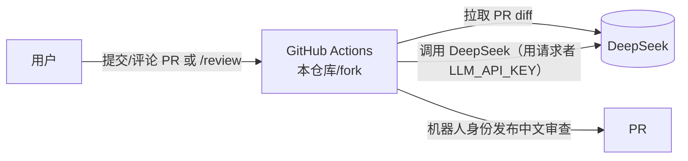

# AI 代码审查（DeepSeek）— 使用说明

本仓库内置一个"类 Copilot"的 AI 代码审查工作流：任何用户可**自动或按需**请求 DeepSeek 对 PR 进行中文代码审查，审查以**机器人身份**发布，**每次审查消耗请求者自己的 DeepSeek 额度**，仓库不保存任何密钥明文。

## 如何工作

- `script/ai_review.py`：拉取 PR 元数据与 diff → 读取 `.github/copilot-instructions.md`（强制中文）→ 调用 DeepSeek → 生成结构化审查（概览 / 问题分级 / 优点 / 重写建议）。
- 发布身份：
  - 默认：`github-actions[bot]`（无需任何额外配置）。
  - 若配置了 GitHub App：以 `gh-chinese-ai-reviewer[bot]` 发布（可发布到任意已安装该 App 的仓库，含上游）。

## 触发方式

| 触发 | 说明 |
|---|---|
| `pull_request`（opened / synchronize / ready_for_review） | 打开或更新 PR 时自动审查（需工作流位于默认分支） |
| 评论 `/review` | 在**本仓库的** PR 上评论 `/review` 即按需审查 |
| `workflow_dispatch` | 手动指定 `repo` 与 `pr` 审查任意公开 PR（含上游） |

去重：同一 head SHA 只会审查一次（评论尾部 `<!--ai-review:<sha>-->` 标记）。

## 配置（fork 自建实例）

### Secrets（Settings → Secrets and variables → Actions）

| 名称 | 必填 | 说明 |
|---|---|---|
| `LLM_API_KEY` | ✅ | 你的 DeepSeek API key（https://platform.deepseek.com/api_keys）。只存在你自己的 fork，明文从不出你侧 |
| `APP_ID` | 可选 | 用于以 App 机器人身份发布（见下「GitHub App」） |
| `APP_PRIVATE_KEY` | 可选 | GitHub App 私钥（`.pem` 全文） |
| `LLM_BASE_URL` / `LLM_MODEL` | 可选 | 默认 `https://api.deepseek.com` / `deepseek-chat` |

### GitHub App（可选，bot 身份发布）

1. https://github.com/settings/apps/new 创建 App（名称勿以 `GitHub`/`Gist` 开头）
2. 权限：**Pull requests Read & write**、**Issues Write**；Webhook 可关；安装范围 **Any account**
3. 生成私钥 `.pem`；把 `APP_ID`、`APP_PRIVATE_KEY` 配进 Secrets
4. 安装到你自己的 fork（`Install App`）；发布到上游仓库时，请仓库维护者从 App 公共页 https://github.com/apps/<app-name> 安装

## 安全模型

- **密钥不会主动打印或记录**：DeepSeek key 只存在于请求者自己的 fork secret / 本地，不经日志打印；上游仓库零密钥。（极端情况：若工作流被恶意修改或日志被泄露，仍有暴露风险——已通过最小权限、不打印密钥、Action 版本审计等措施缓解）
- **自负额度**：每次审查只用触发者自己的 `LLM_API_KEY`（`secrets.LLM_API_KEY`）。
- **bot 身份**：审查以 `github-actions[bot]` 或 GitHub App 机器人发布，不占用用户账号。
- **提示词注入**：密钥绝不进入 prompt；模型输出只作为文本渲染，不执行。
- **工作流安全**：不使用 `pull_request_target`；第三方 Action 建议钉版本；不打印密钥。
- **已知限制**：
  - 审查**上游 PR** 只能通过 `workflow_dispatch` 手动指定 `repo`/`pr`；`/review` 评论与自动审查仅对本仓库（fork）的 PR 生效。
  - fork 内来自其他 fork 的 PR，`pull_request` 事件**读不到 secrets** → 这类 PR 无法自动审。
  - 发布到上游需仓库维护者安装 GitHub App（可随时撤销）。

## 常见问题

- **工作流没跑？** 确认工作流文件在**默认分支**（`issue_comment` / `schedule` / `workflow_dispatch` 只在默认分支触发）。
- **提示缺 `LLM_API_KEY`？** 在 fork 的 Secrets 添加。
- **`/review` 没反应？** 评论触发只对**本仓库的 PR** 有效，且工作流须在默认分支；审查上游 PR 请用 `workflow_dispatch`（填 `repo` 与 `pr`）。
- **想只审一次？** 去重按 head SHA，同一提交不会重复审查。
